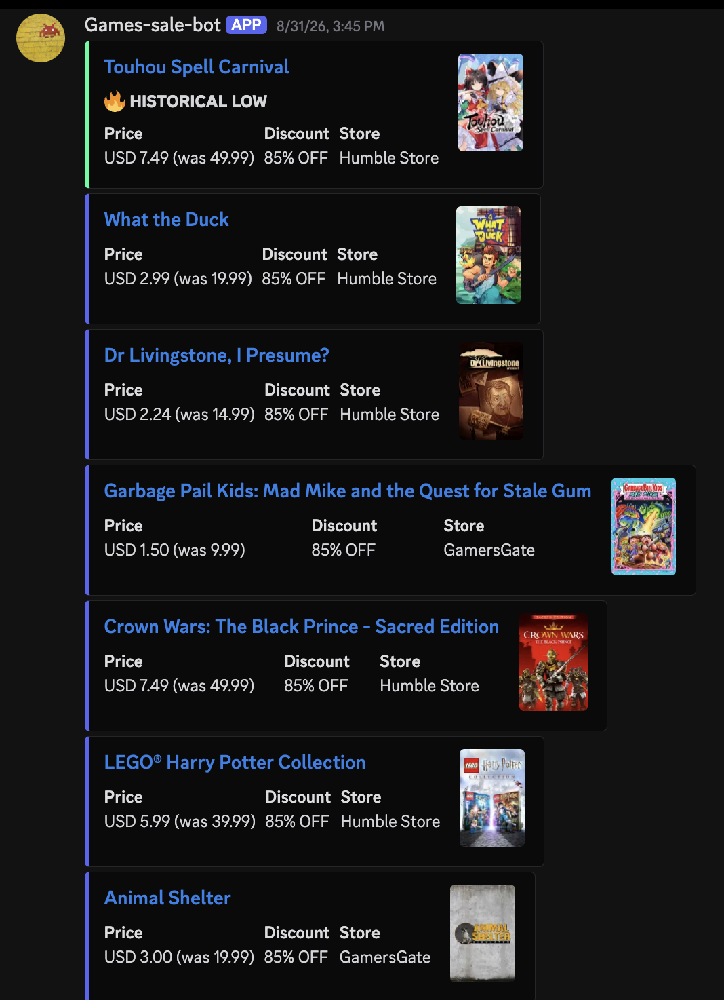
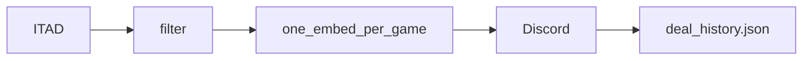

# Game Deals Discord Bot

Posts filtered [IsThereAnyDeal](https://isthereanydeal.com/) deals to one Discord channel on a GitHub Actions cron. No server, no database, no SaaS bill.

[](https://github.com/VictorDoyle/GameDeals-discordbot/actions/workflows/test.yml)
[](https://github.com/VictorDoyle/GameDeals-discordbot/blob/development/.nvmrc)
[](https://yarnpkg.com)
[](LICENSE)

<p align="center">
  
</p>

## What you get

- Filters: discount, Steam rating and review count, DRM, expiry window; optional min/max price, free games, or `source: "giveaways"`
- One embed per game (cheapest shop wins; others listed as Also at)
- Historical-low, near-low, and store-low badges
- Dedup via `deal-history.json` (TTL)
- GitHub Actions every 5 days (`0 14 */5 * *`) plus manual dispatch

## Quick start

1. Fork this repo and enable Actions on the fork.
2. Create a [Discord bot](https://discord.com/developers/applications), invite it to your server, copy the token and a channel id. Register an [ITAD API key](https://isthereanydeal.com/apps/).
3. Repo **Settings → Secrets and variables → Actions**. Add `ITAD_API_KEY`, `DISCORD_TOKEN`, `DISCORD_CHANNEL_ID`.
4. **Actions → Post Game Deals → Run workflow**.
5. Optional: copy [`config/example.config.ts`](config/example.config.ts) to `bot.config.ts` (gitignored), or set Actions env such as `DEALBOT__FILTERS__MIN_DISCOUNT=40`.

## Run locally

Needs Node `22.20.0` ([`.nvmrc`](.nvmrc)).

```bash
corepack enable
yarn install
cp .env.example .env   # then fill the three secrets
yarn build
TEST_MODE=true yarn start   # console only; does not write deal-history.json
```

`yarn start` without `TEST_MODE` posts to Discord and updates history.

## Configuration

Defaults live in [`config/example.config.ts`](config/example.config.ts). Missing `bot.config.ts` uses that file. Shop names (`"steam"`, `"gog"`) resolve in [`src/config/shops.ts`](src/config/shops.ts); numeric [ITAD shop ids](https://docs.isthereanydeal.com/) also work.

| Field | Default | Notes |
|---|---|---|
| `region.country` | `US` | ISO 3166-1 alpha-2 |
| `stores` | `steam`, `gog`, `fanatical`, `3` | Names or ITAD shop ids |
| `source` | `deals` | `giveaways` hits `/giveaways/v1` instead |
| `filters.minDiscount` / `maxDiscount` | 30 / 85 | Percent off |
| `filters.minRating` | 70 | Steam score after `/games/info/v2`. `0` disables |
| `filters.minReviews` | 100 | Steam review count. `0` disables |
| `filters.drm` | `"Steam"` | `"any"` or `[]` disables |
| `filters.minHoursUntilExpiry` | 48 | `0` still drops already-expired deals |
| `filters.includeFree` | `false` | Allow `$0` / 100% cut through the discount cap |
| `filters.minPrice` / `maxPrice` | unset | Sale price bounds |
| `filters.nearLowPercent` | 5 | Badge when price is within this % of history low |
| `limit` | 50 | Target posts per run |
| `dedupe.ttlDays` | 7 | Remember posted game ids |

Invalid config aborts at startup with a path in the message (`filters.minRating must be 0–100, got "seventy"`).

## How a run works



## Security

Three secrets: `ITAD_API_KEY`, `DISCORD_TOKEN`, `DISCORD_CHANNEL_ID`. Never commit `.env`. `bot.config.ts` is gitignored. The post workflow uses `contents: write` so it can commit `deal-history.json`.

## Develop

```bash
yarn test    # offline; MSW fixtures
yarn build
```

Open pull requests against `development`, then merge to `main`.
The post workflow runs on `main` and commits `deal-history.json` there.

## License

[MIT](LICENSE). Free to use, modify, and redistribute. Keep the copyright notice so [Victor Doyle](https://github.com/VictorDoyle) stays credited as the originator.
